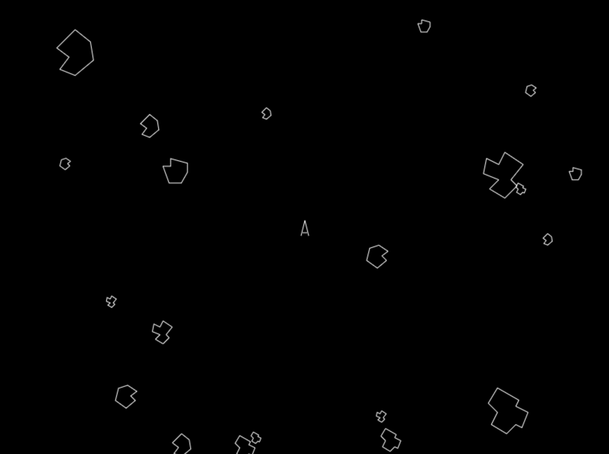

# SECS: Scala Entity Component System

## Prelude
While learning Rust and looking for a fun library to get my hands dirty, [Bevy](https://github.com/bevyengine/bevy) caught my eyes and using ECS (Entity Component System) to manage the artifacts in the game world and interactions within it was pretty refreshing.  So I thought wouldn't it be nice to be able to do the same thing in Scala, especially with the new meta programming facilities made available in Scala 3, maybe I can implement some of the same features without resorting to macros.  Hence this experiment.

## TLDR: What I have accomplished
I tried to model the API after Bevy, though some of the type signatures have changed because we are not restricted (shackled?) by the Rust lifetime checker.  But all in all, I believe I have accomplished what I had set out to do and designed an API that's pretty pleasant to use.  If you want to learn more, read on.

## Entity
I used Opaque Type Alias to model entity which is simply a Int identifier.  Nothing fancy.  Since the identifier is never manipulated directly, there is no need to get the value out.

```scala
opaque type Entity = Int

object Entity:
  def apply(entity: Int): Entity = entity
```

## Component
Components in SECS are simply normal case classes that extends `Component` (marker trait) and derives `ComponentMeta`.  You can put whatever you want in a component and should be immutable.  `ComponentMeta` is a simple way to generate a singleton given for each component type and it uses the derives mechanism in Scala 3 to accomplish the task with minimum boilerplate.

```scala
case class Dimension(width: Double, height: Double) extends Component derives ComponentMeta
```

There are a couple of builtin components which is described below:

### EntityC
`EntityC` is a component that wraps the entity of selected components in the tuple.  It is useful when you want to get to the entity of the selected components, so you can insert/update/remove components on it.  `EntityC` is added automatically to each newly spawned entity, so you don't need to add it yourselves.

```scala
case class EntityC(entity: Entity) extends Component derives ComponentMeta
```

### Label
`Label` component is used to precisicely query a set of similar entities.  It has a String type parameter which is used to identify similarity at the type level so we can use it in our query calculations.  The `id` parameter can be used to differentiate between different entity instances of the same label.  For instance, `Label["asteroid"]` can be used to identify entities that are asteroids in a query.  The `id` parameter can used to further specify the identity of a particular entity.

```scala
case class Label[L <: String](id: Int) extends Component
```

## System
System in SECS are just normal Scala functions.  They are required to be inlined since we are doing some type level trickery to get the necessary information at compile time.  They use using clause to summon both `Command` and `Query` (more on them later) to provide the abilities to view and manipulate components.  I didn't follow the design decision in Bevy to structure systems more rigidly (having API to register them, for instance), instead you are just writing normal functions and use normal scala syntax to compose them.  I think this is more intuitive and flexible.

```scala
inline def updateDimensions(using
      command: Command,
      query: Query1[(EntityC, Dimension)]
  ): Unit = ???
```

## Command
`Command`/`EntityCommand` consist of a simple set of APIs to spawn/despawn (Bevy speak) entities, and manipulate components.  `Command` is used to spawan and despawn entities and `EntityCommand` is used to manipulate components belonging to a particular entity.

```scala
trait Command:
  def spawnEntity(): EntityCommand
  def entity(entity: Entity): EntityCommand
  def despawnEntity(entity: Entity): Unit

trait EntityCommand:
  def entity: Entity
  def insertComponent[C <: Component](component: C)(using CM: ComponentMeta[C]): EntityCommand
  def updateComponent[C <: Component](update: C => C)(using CM: ComponentMeta[C]): EntityCommand
  def removeComponent[C <: Component]()(using CM: ComponentMeta[C]): EntityCommand

```

## Query
Both `Command` and `Query` are passed to system functions when the program runs.  You can write whatever query your system function requires and SECS will try to satisfy it for you.  If the query is invalid (component doesn't exist, for instance), then the compilation will fail and you need to deal with it.  Once the program compiles, it also signifies that the query is valid.  This is what we all strive for to be able to detect our program error at the earliest time possible and compilation time is not bad at all.  The meta programming features in Scala 3 lets us do it quite easily.

Here is the definition for Query, quite simple:

```scala
trait Query[CS <: Tuple, OS <: BoolOps]:
  inline def result: List[CS]
```

For example, the following is a typical system function "using" a `Command` and `Query`:

```scala
inline def updateSpaceship(time: Double)(using
      C: Command,
      Q: Query1[(EntityC, Direction, Movement, Option[CoolOff])]
  ): Unit =
    Q.result.foreach((e, d, m, cO) =>
      // e: EntityC
      // d: Direction
      // m: Movement
      // cO: Option[CoolOff]
      ???
    )
```

So in the above example, the query is meant to gather a list of tuples each consists of components `EntityC`, `Direction`, `Movement`, and optionally `CoolOff` that belong to a single entity.  So if an entity has all the components listed but Direction, then its components will not be gathered.  If an entity has all the components but `CoolOff`, then its components will be gathered with the 4th element (`Option[CoolOff]`) in the tuple being None.  Basically you can look at the query as selecting entities containing all the components queried because that's the expected result.  If some of the component might be missing, wrap it in an Option.

The resulting tuple has the precise types of the query components, optional or not.  As the above code listing shows, the type of the resulting tuple is `(EntityC, Direction, Movement, Option[CoolOff])`, just like the query.  Using the command, you can then examine components, spawn new entities, add new components to them, update existing components (immutably, of course), even remove components if you like.

For those of you who are really paying attention, you will probably be wondering why am I writing about `Query` while in the code it's `Query1`?  Good question and that`s what we are going to explain next.

## Filter
The actual `Query` takes not 1 but 2 type parameters: the first one is expected result tuple type and the second one specifies a filter (or conditions) that the selected entity has to satisfy in order to be gathered in the result.  `Query1` is just a special case of `Query` that takes just one type parameter.  The filter can have and(`∧`), or(`∨`), and not(`¬`) conditions of arbitrary nested levels (actually the depth of scala compiler is willing to go, default to 32).

For example, `[Heading ∧ Dimension] ∨ ¬[Rotation]` signifies a filter that only selects entities having both Heading and Dimension components or not having Rotation component.  The component types that appears in the filter is only for selecting criteria only, they will not be appearing in the query result list.

```scala
inline def system(using query: Query[(EntityC, Dimension, Heading), ¬[Rotation]]): Unit = ???
```

The above query will return a list of tuples of type (EntityC, Dimension, Heading) containing in entities which don't contain Rotation.

## Event
The way SECS manages events is a little different than what Bevy does.  There are builtin components `EventSender[E]` and `EventReceiver[E]` where `E` is an arbitrary event type (case class) that derives both `EventSenderCM` and `EventReceiverCM`.  Entities can add `EventSender[E]` to send events of type `E` and `EventReceiver[E]` to receive events of type `E`.  Multiple entities can add the same `EventSender[E]` and send events to the event queue where they will be aggregated.  Every `EventReceiver[E]`, on the other hand, can receive the same events of type `E` from the same queue and process them.  The queue will only persist for one tick (animation frame).  So after each tick, all the event queues will be emptied.

```scala
case class EventSender[E]() extends Component:
  def send(event: E)(using CM: ComponentMeta[EventSender[E]], W: World): Unit = W.sendEvent(event)

case class EventReceiver[E]() extends Component:
  def receive(using CM: ComponentMeta[EventSender[E]], W: World): Iterable[E] = W.receiveEvents
```

Events are great for systems to exchange information that might be cumbersome to do via inserting, querying, and removing components.  Even though system in SECS are compose of functions and functions compose, using events this way shows our intent clearly and aids in the querying of components as well.

## Secs
To tie everything together, we have `Secs`.  It's a trait that every SECS program needs to implement in order to run.  Methods in Secs are lifecycle methods (borrowing a React term) and are called when the occasions arise.

```scala
trait Secs:
  type Worldly = World ?=> Unit
  def init(): Worldly
  def tick(time: Double): Worldly
  def beforeRender(): Unit
  def renderEntity(entity: Entity, components: Components): Unit
  def afterRender(): Unit
```

`init()` is called when Secs is started by calling `Secs.start()`.  You usually call any initialization system functions there.

`tick()` is called every animation frame (in case of browser, 60 times per second).  You usually call system functions that needs to be executed on every animation tick there.  The `time` parameter is the elapsed time in milliseconds.

`beforeRender()` and `afterRender()` are also called every animation frame.  Both are called after `tick()` and sandwich calls to `renderEntity()` in between.  Things that requires by rendering on every frame, like erasing the background, is done in `beforeRender()`.

`renderEntity()` is called once for each entities in the system on every frame.  The `entity` parameter is the entity that's rendering and the `components` parameter has methods to query components of that entity.

```scala
object Secs:
  def start(secs: Secs)(using world: World): Double => Unit = ???
```

To start the whole thing, call `Secs.start()`. it takes a `Secs` you implemented and returns a function you can call with the elasped time in milliseconds many times per second to get the animation going.

## World
You might see `World` required as a context parameter in some of the APIs.  We won't be going into much details here.  It is an implementation detail and should not be a concern for you as an API user.

## Example: Asteroids
I made an simple and imcomplete Asteroids game to demostrate features of SECS.  It currently runs in the browser using HTML's canvas API for screen rendering.  Yes, the core SECS is cross-built for both Scala and Scala.js, it it will work as a library for both JVM and Javascript.  I've abstrated the rendering and input parts of the program so it will be easy to port it to JavaFX if I have the time.

To run, `examples/fastLinkJS` in sbt to generate the necessary artifacts, then point your browser to `web/index.html`.  Left/right keys to turn, up key to accelerate, and space key to fire.



Some technical details worth mentioning:

### UI abstration
Both the rendering and keyboard input APIs are abstracted to facilitate easier multiplatform implementation later on.

### Events
Both `TorpedoPoation` and `SpaceshipPosition` events are sent by the `EventSender` in torpedo and spaceship entities respectively.  These events are sent so that `EventReceiver` later on can process the events and detect if there were any collisions.

```scala
case class TorpedoPosition(entity: Entity, pos: (Double, Double)) derives EventSenderCM, EventReceiverCM
case class SpaceshipPosition(entity: Entity, pos: (Double, Double)) derives EventSenderCM, EventReceiverCM
```

